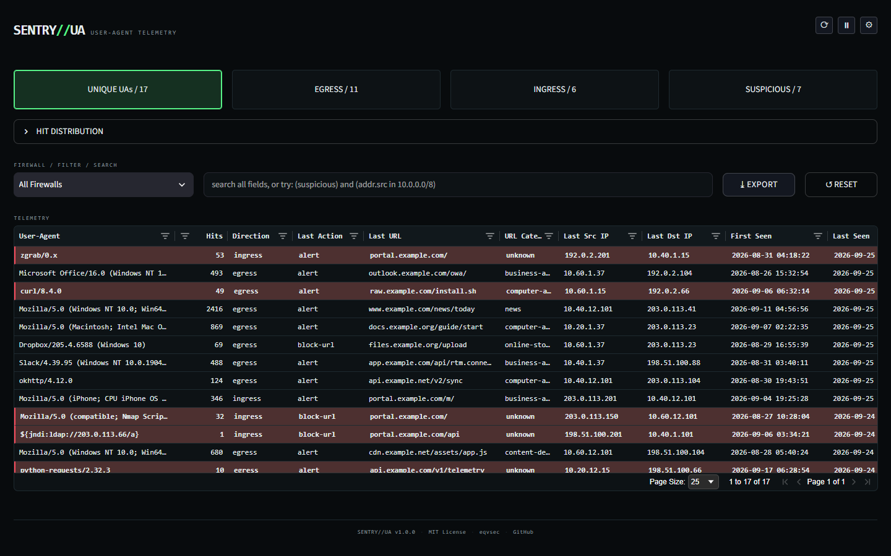
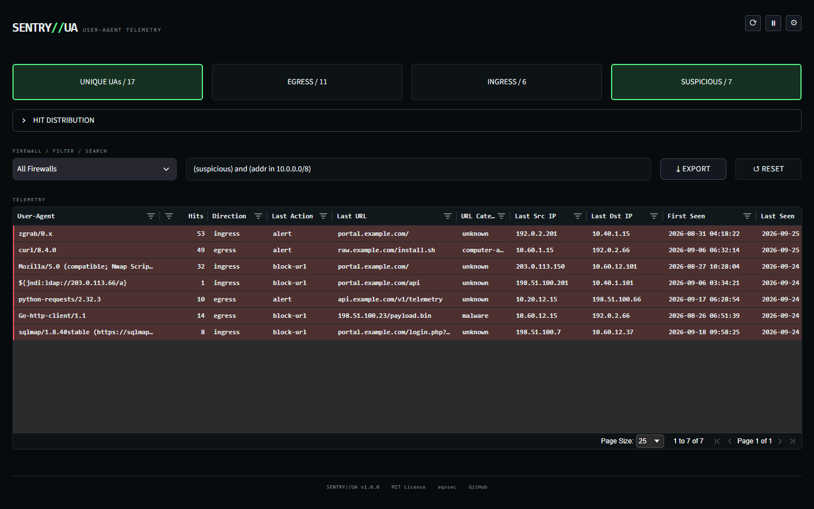
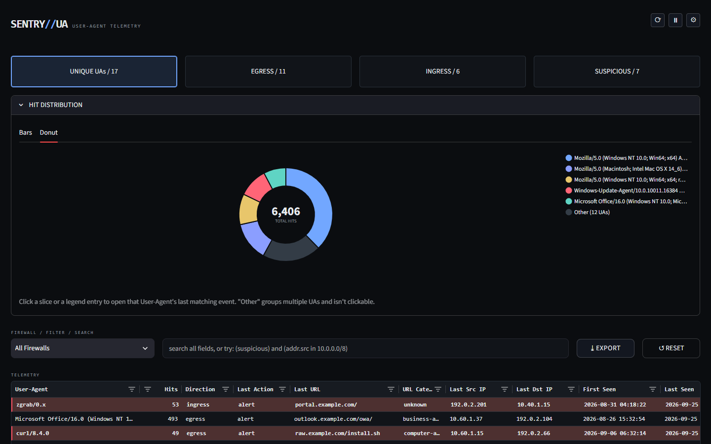
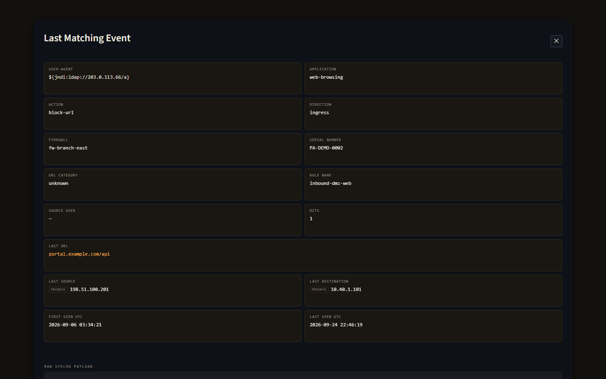

# Sentry UA

**v1.0.0** · [MIT License](LICENSE)

A User-Agent telemetry dashboard and UDP syslog collector for Palo Alto Networks PAN-OS firewalls.

> This is an independent, community-built tool. It is not affiliated with, endorsed by, or sponsored by Palo Alto Networks, Inc. "Palo Alto Networks" and "PAN-OS" are trademarks of Palo Alto Networks, Inc., used here only to describe compatibility. No Palo Alto Networks logos, wordmarks, product UI assets, or color schemes are reproduced anywhere in this app.

**eqvsec** · *esse quam videri* · [eqvsec.com](https://eqvsec.com) · [eqvsec.net](https://eqvsec.net) · [@eqv_sec](https://x.com/eqv_sec) · [GitHub](https://github.com/eqvsec)



| Structured search | Hit distribution | Event inspector |
| --- | --- | --- |
|  |  |  |

*Screenshots use the synthetic demo dataset (`python -m sentry_ua.demo`) - every firewall, IP, and URL in them is fabricated (RFC 5737 / RFC 2606 ranges). See [Try it with demo data](#try-it-with-demo-data).*

## Features

- **UDP syslog collector** for PAN-OS URL Filtering logs, stored in SQLite: one row per User-Agent + direction + firewall, with hit counts, first/last seen, and the latest matching event kept for investigation.
- **Egress/ingress classification** from zone names - you only list the zones that face outside your trust boundary; everything else (LAN, DMZ, per-site naming) is handled without extra config.
- **Multi-firewall, no registry to maintain** - firewalls are discovered from each log's serial number and hostname. View one firewall, or all of them aggregated fleet-wide.
- **Suspicious User-Agent highlighting** - scanners and scripted clients (`curl`, `python-requests`, `sqlmap`, `nmap`, `zgrab`, ...), Log4Shell-style `${jndi:` probes, shellshock, and SQL-injection shapes.
- **PAN-OS-style search** - `(suspicious) and (addr.src in 10.0.0.0/8)`, with the metric tiles acting as one-click editors of the same query. See [Search syntax](#search-syntax).
- **Event inspector** - the latest raw syslog for any row, with rule name, source user, App-ID, URL category, IP classification, a country flag for public IPs, and VirusTotal / AbuseIPDB / copy actions.
- Sortable, filterable table (AG Grid), CSV export (raw payload excluded), bar and donut hit-distribution charts.
- **Optional Google Chat alert** the first time a User-Agent appears on each firewall.
- Three dark themes; preferences are per-browser (URL + cookie), never shared between users of the same server.
- Source-IP allow-lists for both the collector and the dashboard, and optional HTTPS - read [Security](#security) for exactly what they do and don't guarantee.

## Quick start

Simplest option - starts both the collector and the dashboard together, and stops both together on Ctrl+C:

```text
pip install -r requirements.txt
python run_dashboard.py
```

Or run each piece separately (useful if the collector runs elsewhere, e.g. its own service or a different host):

```text
pip install -r requirements.txt
python palo_ua_tracker.py
streamlit run dashboard.py
```

`python run_dashboard.py --no-collector` starts only the dashboard, for the same "collector runs elsewhere" case without giving up the HTTPS convenience below.

For HTTPS, `run_dashboard.py` is required (not just convenient) - see [HTTPS](#https) below.

### Try it with demo data

No firewall needed - this builds a database of synthetic PAN-OS URL Filtering events (three fake firewalls, normal browsers and apps, plus the kinds of scanners/probes the Suspicious tile exists for) by feeding them through the collector's own `process_syslog()`, then points the dashboard at it:

```text
python -m sentry_ua.demo
SENTRY_UA_DB_PATH=demo_user_agents.db streamlit run dashboard.py
```

(PowerShell: `$env:SENTRY_UA_DB_PATH="demo_user_agents.db"; streamlit run dashboard.py`.) Every value is fabricated: firewall serials are `PA-DEMO-*`, IPs come only from `10.0.0.0/8` and the RFC 5737 documentation ranges, URLs only from RFC 2606 `example.*` domains. The demo never sends alerts, whatever `config.yaml` says.

## Configuration

Everything lives in `config.yaml`, and each setting is documented in comments there. In short:

| Section | What it controls |
| --- | --- |
| `network` | UDP listen address/port (default `0.0.0.0:1514`) and `allowed_sources`, the collector's source-IP allow-list. |
| `database` | `db_path` for the SQLite file, used by both processes. The `SENTRY_UA_DB_PATH` environment variable overrides it. |
| `alerts` | `gchat_webhook_url` - leave empty to disable alerts. |
| `zones` | `external_zones` - the zone names that face outside your trust boundary. |
| `log_format` | PAN-OS CSV field positions. The defaults match the [URL Filtering log format](https://docs.paloaltonetworks.com/ngfw/administration/monitoring/use-syslog-for-monitoring/syslog-field-descriptions/url-filtering-log-fields). |
| `dashboard` | Default refresh interval and `allowed_sources`, the dashboard's source-IP allow-list. |
| `https` | Optional TLS for the dashboard - see [HTTPS](#https). |

On the firewall side, forward URL Filtering logs to the collector's address and port over UDP syslog in the default CSV format.

## Search syntax

The search box takes plain text (a case-insensitive substring match across every column) or a filter modeled on PAN-OS's own log filter syntax:

```text
((addr in 10.0.0.0/8) or (addr in 172.25.0.0/16)) and (url contains example)
!(action eq allow) and (device.serial eq 013101001234)
(suspicious) and (egress)
```

| Field | Matches | Operators |
| --- | --- | --- |
| `user_agent` | User-Agent | `eq`, `neq`, `contains` |
| `url` | Last URL | `eq`, `neq`, `contains` |
| `action` | Last action | `eq`, `neq`, `contains` |
| `device` / `device.serial` | Firewall hostname / serial number | `eq`, `neq`, `contains` |
| `addr.src` / `addr.dst` | Last source / destination IP | `eq`, `neq`, `in` (CIDR) |
| `addr` | Either source or destination IP | `eq`, `neq`, `in` (CIDR) |

- **Standalone filters:** `(suspicious)`, `(egress)`, `(ingress)` - these are what the metric tiles add and remove.
- **Combine** with `and`, `or`, `not` (or `!`), and parentheses, nested as deep as you like.
- **Quoting** is only needed for a value containing spaces or parentheses, starting with `'` or `!`, or equal to `and`/`or`/`not`: `user_agent eq curl/8.0` works as-is; `user_agent contains 'Mozilla/5.0 (Windows'` needs quotes.
- **Structured + free text:** `(egress) fw-branch` applies the structured part and then an ordinary substring match for the rest.
- A query that doesn't parse (typo, unknown field, still being typed) quietly falls back to a plain-text search rather than showing an error.
- Text matching is case-insensitive; CIDR matching uses Python's `ipaddress` module. For first/last seen and hit counts, use the table's own column sorting and filters.

## Docker

```text
docker compose up -d --build
```

One image, two containers: `collector` (`palo_ua_tracker.py`, the database's only writer, UDP 1514) and `dashboard` (`run_dashboard.py --no-collector`, TCP 8501), sharing the SQLite database on a named volume at `/data` (`SENTRY_UA_DB_PATH=/data/user_agents.db`). `config.yaml` is mounted read-only from the host, so edit it there and `docker compose restart`. Both run as an unprivileged user. Keep the volume on local disk - SQLite's WAL mode relies on shared memory between the two containers and isn't safe on a network filesystem. For HTTPS, mount your cert/key into the `dashboard` service (there's a commented `./certs` example in `compose.yaml`) and point `https.cert_file`/`key_file` at the container paths.

**Read this before relying on either allow-list under Docker.** Both `network.allowed_sources` and `dashboard.allowed_sources` depend on seeing the real client IP, and Docker's port publishing doesn't always preserve it:

- **Docker Desktop (Windows/macOS), and rootless Docker with its default port driver:** published ports are forwarded through a proxy, so every packet and connection appears to come from a Docker-internal gateway address. Verified while building this: under Docker Desktop, a syslog packet sent from the host arrived at the collector as `172.17.0.1`. On these platforms, an allow-list narrowed to your firewalls' real IPs drops *everything* (fail closed - loud `Dropped [ACL]` warnings, no data), and adding the gateway address to "fix" that allows *everyone*. Leave both at `0.0.0.0/0` there and restrict access outside the container instead.
- **Linux Docker Engine (rootful, default bridge network):** published ports are forwarded by iptables DNAT, which normally preserves the real source IP, so both allow-lists see real addresses - but check yours in the collector's `Dropped [ACL]` log lines before trusting that.
- **Host firewalls:** on Linux, traffic to a published port is DNAT'd before it reaches the host's INPUT chain, so rules in `ufw`/`firewalld` that you'd expect to protect port 1514/8501 **don't apply to Docker-published ports**. Put restrictions in the `DOCKER-USER` iptables chain, publish the ports on a specific host IP (e.g. `"10.0.0.10:1514:1514/udp"`), or use host networking.
- **Host networking (Linux only)** - `network_mode: host` on both services, and drop the `ports:` entries - makes both allow-lists and ordinary host firewall rules behave exactly as they do outside Docker. It's the closest match to the bare-metal security model documented everywhere else in this README.

## HTTPS

Off by default - fine for a dashboard reached directly on a fully trusted network. To turn it on:

1. Set `https.enabled: true` and both `cert_file`/`key_file` paths in `config.yaml`.
2. Start the dashboard with `python run_dashboard.py` instead of `streamlit run dashboard.py`.

Streamlit's own HTTPS support (`server.sslCertFile`/`server.sslKeyFile`) has to be set before its server starts listening - before `dashboard.py` itself ever runs - so it can't be wired up from inside the app script. `run_dashboard.py` reads `config.yaml`'s `https` section and passes the cert/key through to `streamlit run` as command-line flags instead. Plain `streamlit run dashboard.py` still works exactly as before if `https.enabled` is left `false`.

Per [Streamlit's own docs](https://docs.streamlit.io/develop/concepts/configuration/https-support), this feature "has not gone through extensive security audits or performance tests," and for anything beyond casual/internal use they recommend SSL termination at a reverse proxy or load balancer instead. Treat this as a convenience for a small internal deployment, not a substitute for a reverse proxy if the dashboard is ever more exposed.

## Security

Read [SECURITY.md](SECURITY.md) before exposing either port beyond a trusted network. In short:

- **PAN-OS syslog has no authentication**, so anything that can reach the UDP port can inject fabricated telemetry. `network.allowed_sources` drops packets from other source IPs before any parsing happens - narrow it to your firewalls, and back it with a host firewall rule.
- **The dashboard has no login.** `dashboard.allowed_sources` is a best-effort source-IP gate that works when Streamlit is reached directly. It stops being meaningful behind a reverse proxy or Docker Desktop's port forwarding, and a host firewall is the real control. Put the dashboard behind an authenticating reverse proxy if it needs wider reach.
- **Both allow-lists default to `0.0.0.0/0`** (allow everything), because the app can't know your firewalls' addresses. Set them before relying on them.
- Every syslog-derived value shown in the dashboard is HTML-escaped. The event inspector also renders in an isolated iframe with no access to the app, and Google Chat alerts neutralize Chat's markup characters.
- **Third-party lookups:** opening the inspector for a row with a public IP sends that IP to [ipwho.is](https://ipwho.is) (over HTTPS) for the country flag. The VirusTotal/AbuseIPDB buttons are plain links, and nothing is sent unless you click them.

To report a vulnerability, see [SECURITY.md](SECURITY.md).

## Upgrading an existing database

The collector adds new columns to an existing `user_agents` table automatically. The one exception is a database created before multi-firewall support: its primary key can't be changed in place, so move that `user_agents.db` aside once and let the collector build a fresh one.

## Development

```text
pip install -r requirements.txt -r requirements-dev.txt
python -m pytest
```

The suite covers the collector (ACL, zone-to-direction table, CSV extraction, upsert/alerting, Google Chat sanitization, schema migration), the query language (parsing, fallback rules, evaluation, the tile/AST round trip), the data layer against real collector-written databases, the event inspector's HTML escaping (checked by actually parsing the rendered tiles), the launcher's HTTPS wiring, and the full `dashboard.py` script run headless through Streamlit's `AppTest` against demo data - including the dashboard allow-list gate. Known, not-yet-fixed bugs are recorded as strict `xfail` tests (none at the moment): they're expected to fail, and the run fails the moment one starts passing, so the marker gets removed together with the fix.

CI (`.github/workflows/ci.yml`) runs `py_compile`, `pyflakes`, and the tests on Python 3.10/3.12/3.14, then builds the Docker image, starts the compose stack, sends a real UDP syslog packet, and checks it landed in the database.

## Files

- `config.yaml` — listener, database, zones, and Palo Alto field indexes.
- `palo_ua_tracker.py` — UDP syslog collector and SQLite writer.
- `dashboard.py` — Streamlit dashboard.
- `run_dashboard.py` — optional launcher; starts both the collector and the dashboard together (or just the dashboard with `--no-collector`), and is required for HTTPS (see [HTTPS](#https)).
- `sentry_ua/` — the dashboard's supporting code, split out of `dashboard.py` with no behavior change: `query.py` (suspicious signatures + the PAN-OS-style search language), `data.py` (read-only SQLite loading layer), `config.py` (config.yaml, DB path, dashboard allow-list helpers), `theme.py` (themes + CSS), `ui_helpers.py` (event-inspector tiles, URL/IP helpers), `demo.py` (synthetic demo data). None of it imports Streamlit, so all of it is unit-testable; `dashboard.py` stays at the repo root as the Streamlit page script.
- `tests/` — pytest suite (see [Development](#development)).
- `scripts/capture_screenshots.py` — regenerates `docs/screenshots/` from a running demo dashboard.
- `Dockerfile`, `compose.yaml`, `.dockerignore` — container packaging (see [Docker](#docker)).
- `.github/workflows/ci.yml` — GitHub Actions: compile, lint, tests on three Python versions, plus a Docker build + end-to-end smoke test. `.github/workflows/codeql.yml` — CodeQL security scanning. `.github/dependabot.yml` — weekly dependency update PRs.
- `requirements.txt` — Python dependencies. `requirements-dev.txt` — test/CI-only extras.
- `CHANGELOG.md` — the decision log.
- `LICENSE` — MIT.
- `SECURITY.md` — how to report a vulnerability, and the known-by-design tradeoffs.

## Contributing

This is currently a solo project — not open to pull requests at this time. Bug reports and feature ideas are welcome as GitHub issues; see [SECURITY.md](SECURITY.md) instead for anything security-sensitive.

## Changelog

[CHANGELOG.md](CHANGELOG.md) is the project's decision log: every change, including reverted approaches, with the reasoning behind it.

## License

[MIT](LICENSE).
